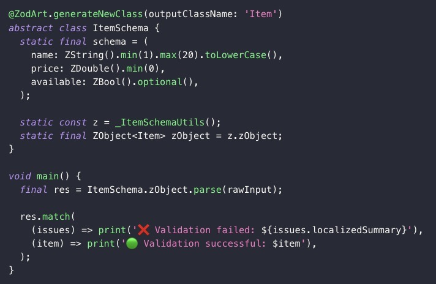

[ZodArt](https://pub.dev/packages/zodart) is a type-safe, parse-first schema validation package with static type inference for Dart and Flutter.

Parse unstructured data from APIs, Flutter forms, config files, and more — with type safety and static type inference.
ZodArt provides a powerful and expressive API to define validation schemas and parse unknown data into strongly typed Dart values.

## Features

- 🛡️ **Rock-solid type safety** with optional code generation (no more magic strings!)
- 🧠 **Static** type inference
- 🧱 Define schemas for both primitive and complex types
- 📦 Parse unknown or unstructured data into strongly typed Dart values
- 🤝 Seamless integration with `freezed` models
- ♻️ **Composable and reusable** schemas for easy code sharing and modularity
- 🧩 Supports nested objects, arrays, optional and nullable fields
- 📏 Built-in various validation rules (e.g. `.min()`, `.max()`, etc.)
- 🧪 Support for user-defined custom rules via `.refine()`
- 💬 Rich, localizable, developer-friendly error messages
- 🌐 Designed for use with REST APIs, GraphQL, JSON files, and form input

## Comparison

| ❌ Without ZodArt                          | ✅ With Zodart                       |
| ------------------------------------------ | ------------------------------------ |
|  |  |

You can check the planned features and report bugs or request features by opening an issue on the [GitHub page](https://github.com/zzundalek/zodart/issues).
